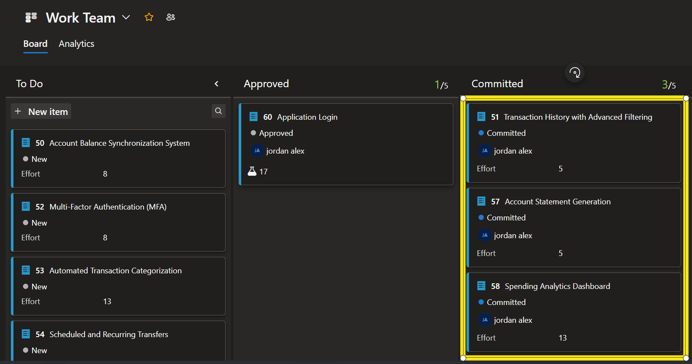
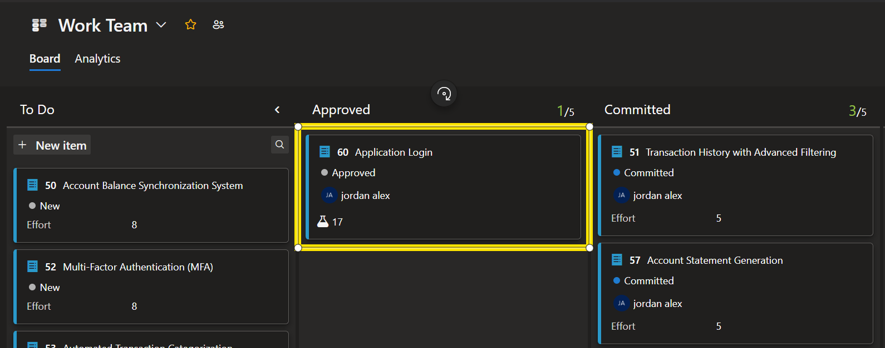

## Secure Bank Application Setup
### Setup Instructions

1. Clone the repository:  
    `git clone https://github.com/jorale2415/SecureBank.git`
2. Change to the `SecureBank` directory in your terminal.
3. Install the required dependencies:  
    `npm install`
4. Launch the development server:  
    `npm run dev -- --port 5173`
5. Open your browser and navigate to `localhost:5173` to access the login page and start testing.

---

## Azure DevOps

### Quick Links

- [Azure DevOps Boards](https://dev.azure.com/jordanalex0558/Work/_boards/board/t/Work%20Team/Backlog%20items)
- [All Bugs Query](https://dev.azure.com/jordanalex0558/Work/_queries/query/63ed5c7a-b340-46ed-9ea9-b372e234f267/)
- [All Test Cases Query](https://dev.azure.com/jordanalex0558/Work/_queries/query/15f68f13-77da-4d83-a2d0-954dc4d99105/)

### Creating Test Cases
The following product backlog items have been completed by a developer and are now ready for QA review. Your task is to design test cases for each backlog item and conduct confirmation testing to verify that the requirements have been met and the implementation is issue-free. If any bugs are discovered, create a bug report and update the status accordingly.

- [Transaction History with Advanced Filtering (PBI 51)](https://dev.azure.com/jordanalex0558/Work/_workitems/edit/51)
- [Account Statement Generation (PBI 57)](https://dev.azure.com/jordanalex0558/Work/_workitems/edit/57)
- [Spending Analytics Dashboard (PBI 58)](https://dev.azure.com/jordanalex0558/Work/_workitems/edit/58)

### Exploratory Testing

1. Find an issue or bug not already tracked.
2. Document a test case for the identified issue.
3. Create a bug ticket with clear reproduction steps and acceptance criteria.

### Playwright Testing

- Review the Playwright tests for login in `tests/Login.spec.ts`.
- Execute tests for Login Functionality, Accessibility, and Edge Cases.
- Analyze any failed tests to determine if the problem is with the application or the test itself.
- If the issue is with the test, show how to debug and fix it.

Test cases for the login feature are linked in [Product Backlog Item 60: Application Login](). If restructuring is needed, refer to these cases.  

### Selecting Tests for Automation

1. Choose a previously written test case.
2. Explain your reasoning for automating this test case.
3. Write a Playwright test for it, using online resources as needed.

### Planning UI Test Automation

1. Describe your approach for structuring a delivery plan to implement UI testing in a new application.
2. Discuss key considerations when planning automation, such as test coverage, maintainability, and integration with CI/CD.